<!-- animated contribution graph from real data, regenerated daily by
     .github/workflows/update-profile-art.yml -->

<h3><code>khalid@github ~ $ ./contributions.sh</code></h3>

 
 

<!-- ascii portrait (left) + stats card (right); both svgs are 840x880 so
     equal widths give equal heights.
     portrait: python scripts/make_ascii_svg.py <photo>
     stats:    python scripts/render_stats_svg.py (same daily workflow) -->

<h3><code>khalid@github ~ $ whoami</code></h3>

<table>
<tr>
<td valign="top"></td>
<td valign="top"></td>
</tr>
</table>

 
 

<h3><code>khalid@github ~ $ ./links.sh</code></h3>

<b>CS @ UMN</b>

 
 

<h3><code>khalid@github ~ $ ls ~/stack</code></h3>

 

